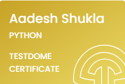
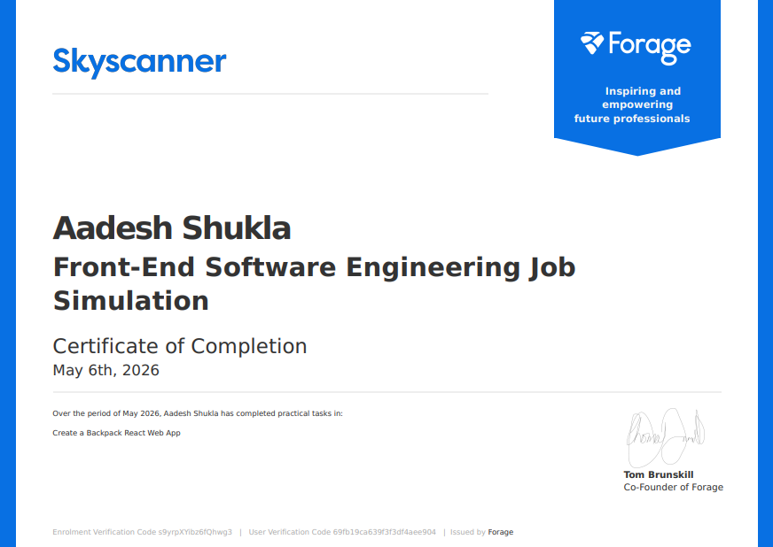
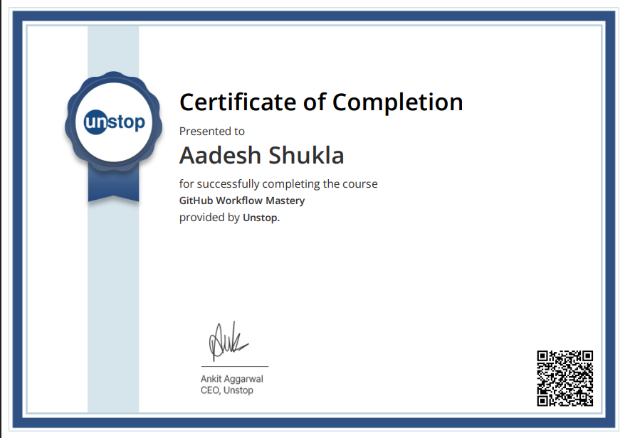

# Hey, I'm Aadesh Shukla 

**Full-Stack Developer · AI Integration · MERN Stack**

I build real-world web applications that integrate AI into usable products — not just demos.
Currently in my final year of B.Tech (CSE) at St. Mary's Integrated Campus, Hyderabad.

🟢 **Open to internships & part-time roles**

---
## 🏆 Technical Certifications & Badges

<table>
  <tr>
    <td align="center" valign="top" width="25%">
      <h3>IBM SkillsBuild</h3>
      
        
      <strong>Certificate:</strong>  <a href="https://www.credly.com/badges/39f1010b-56ff-4ff2-bc61-cce28aeb1ea3" target="_blank">Verify on Credly</a>
    </td>
    <td align="center" valign="top" width="25%">
      <h3>Claude Code 101</h3>
      
        
      <strong>Certificate:</strong>  <a href="https://verify.skilljar.com/c/4p2tf3psbdx9" target="_blank">View Certificate</a>
    </td>
    <td align="center" valign="top" width="25%">
      <h3>TestDome Python</h3>
      
        
      <strong>Certificate:</strong>  <a href="https://www.testdome.com/certificates/b9f054669f5745dab8981e7dc017301a" target="_blank">Verify Gold Badge</a>
    </td>
    <td align="center" valign="top" width="25%">
      <h3>TestDome JavaScript</h3>
      
        
      <strong>Certificate:</strong>  <a href="https://www.testdome.com/certificates/64bbf6399e1e4a1f8599e1e3f2a434f0" target="_blank">Verify Gold Badge</a>
    </td>
  </tr>

  <tr>
    <td align="center" valign="top" width="25%">
      <h3>Claude Code in Action</h3>
      
        
      <strong>Certificate:</strong>  <a href="https://verify.skilljar.com/c/iztoy9xo9t8x" target="_blank">View Certificate</a>
    </td>
    <td align="center" valign="top" width="25%">
      <h3>Quantitative Research</h3>
      
        
      <strong>Certificate:</strong>  <a href="https://www.theforage.com/completion-certificates/Sj7temL583QAYpHXD/bWqaecPDbYAwSDqJy_Sj7temL583QAYpHXD_69fb19ca639f3f3df4aee904_1778653707542_completion_certificate.pdf" target="_blank">View Certificate</a>
    </td>
    <td align="center" valign="top" width="25%">
      <h3>Frontend Software Engineering</h3>
      
        
      <strong>Certificate:</strong>  <a href="https://www.theforage.com/completion-certificates/skoQmxqhtgWmKv2pm/km4rw7dihDr3etqom_skoQmxqhtgWmKv2pm_69fb19ca639f3f3df4aee904_1778068553253_completion_certificate.pdf" target="_blank">View Certificate</a>
    </td>
    <td align="center" valign="top" width="25%">
      <h3>Github Workflow Mastery</h3>
      
        
      <strong>Certificate:</strong>  <a href="https://unstop.com/api/course/certificate/1dab851c-5ad3-4e09-bab0-bbe030805857/view" target="_blank">View Certificate</a>
    </td>
  </tr>
</table>
---

## 🚀 Featured Projects

### 🎯 [Pathfinder-AI](https://github.com/aadeshshukla/pathfinder-ai) — AI Learning Roadmap Generator
> Full-stack SaaS app that generates personalized learning roadmaps using Groq's LLaMA 3.1 model

- Authentication, encrypted passwords, user dashboards, saved roadmaps
- Rate limiting,  security, Framer Motion UI
- **Stack:** React 18 · Node.js · Express · MongoDB · Groq SDK · JWT

---

### 🎯 [Results-Analytics](https://github.com/aadeshshukla/AI-COLAB/tree/main/results-analytics) — JNTUH Results Analytics Dashboard
> A React + Vite single-page application (SPA) that lets students fetch their JNTUH academic results using a roll number, and then shows:

- Student profile details
- Semester-wise subject marks + grades + credits + SGPA
- An analytics dashboard with charts and summary cards
- **Stack:** React 18 · 

---

### 🔒 [Life Tracker](https://github.com/aadeshshukla/LifeTracker) — Privacy-First AI Diary
> Zero-server diary app running semantic search entirely in the browser — no data ever leaves the device

- Transformers.js runs embedding models client-side
- IndexedDB (Dexie.js) for 100% offline, local-first storage
- Natural language queries: *"When did I feel happy about coding?"*
- **Stack:** React 19 · Transformers.js · Dexie.js · IndexedDB

---

### 💬 [Mausam AI](https://github.com/aadeshshukla/mausamAI-frontend) — LLM Chatbot
> Real-time conversational AI interface powered by Meta LLaMA API

- Async API communication with clean state management
- Fully responsive across all devices
- **Stack:** React · Llama API · JavaScript · CSS3

---

## 🛠️ Tech Stack

**Frontend**

**Backend**

**AI & Tools**

---

##  Languages & Fluency

| Language | Proficiency | Level |
|---|---|---|
| JavaScript | ████████░░ | Moderate |
| Python | ████████░░ | Moderate |
| SQL | █████░░░░░ | Basic |
| Java | ████░░░░░░ | Basic |
| C | ████░░░░░░ | Basic |

---

## 📊 GitHub Stats

  

---

*Currently mastering AI Skills —  better prompt engineering, TRACKING .*

**If you find my projects useful and intresting, a STAR⭐ means a lot!**

